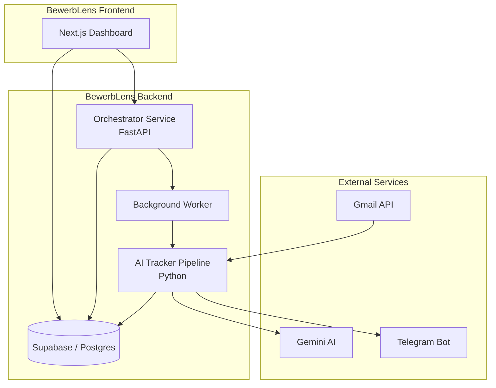

# BewerbLens

> **BewerbLens** — Your intelligent lens on the job application process. An end-to-end, AI-powered job application tracker that automatically ingests, classifies, and monitors your job application emails — then surfaces everything on a beautiful real-time dashboard.

---

## Overview

BewerbLens solves a universal problem for job seekers: **tracking applications scattered across email inboxes, spreadsheets, and job portals**. It replaces manual tracking with an automated pipeline that:

1. **Fetches** emails from Gmail continuously
2. **Classifies** them with Google Gemini AI (Applied, Rejected, Interview, Offer, etc.)
3. **Stores** everything in Supabase with zero-duplicate guarantees
4. **Notifies** you via Telegram when status changes occur
5. **Visualizes** your entire job search on a Next.js dashboard with analytics
6. **Orchestrates** background tasks with a dedicated worker and scheduler

---

## Architecture



### Components

| Component | Tech Stack | Purpose |
|---|---|---|
| **Orchestrator** | FastAPI, APScheduler | REST API, job scheduling, and worker management |
| **Worker** | Python Threading | Background task execution (ingestion, analysis) |
| **AI Tracker** | Python 3.11+, Gemini AI | Core logic for email ingestion & classification |
| **Dashboard** | Next.js 16, React 19, Recharts | Real-time tracking UI & monitoring |
| **Database** | Supabase (PostgreSQL) | Persistent storage, task queue, and logs |

---

## Features

### System Orchestration
- **Real-time Monitoring** — Track background task progress and logs directly from the dashboard.
- **Smart Scheduling** — Configurable intervals for automated ingestion.
- **Manual Triggers** — Start a sync or backfill on-demand via the UI or API.
- **Multi-user Ready** — Data isolation and user-specific configurations.

### AI Pipeline
- **Incremental Checkpointing** — Only processes new emails since the last successful run.
- **Gemini 1.5 Flash** — Native AI classification for high accuracy and speed.
- **Fuzzy Matching** — Intelligently links status updates to existing applications even if names vary.
- **Status Priority** — Logic to ensure terminal states (like Offer or Rejected) are preserved.

### Premium Dashboard
- **Pipeline View** — Dedicated page to monitor execution history and logs.
- **Analytics Hub** — Interactive charts for application trends and platform performance.
- **Modern UI** — Glassmorphic design, dark mode support, and responsive layouts.

---

## Project Structure

```
BewerbLens/
├── apps/                          # Core Applications
│   ├── orchestrator/              # FastAPI Task Manager
│   │   ├── main.py                # Entry point
│   │   ├── routers/               # API Endpoints (runs, config)
│   │   └── services/              # Worker & Scheduler logic
│   │
│   ├── tracker/                   # AI Processing Pipeline
│   │   ├── tracker.py             # Main entry point for sync
│   │   ├── gemini_classifier.py   # AI integration
│   │   └── supabase_service.py    # DB interactions
│   │
│   └── dashboard/                 # Next.js Frontend
│       ├── src/app/               # App Router pages
│       └── components/            # UI Components
│
├── docs/                          # Detailed Documentation
│   ├── architecture.md            # System deep-dive
│   ├── api.md                     # Orchestrator API spec
│   └── deployment.md              # Setup & Hosting guides
│
├── scripts/                       # Infrastructure & Utils
├── docker-compose.yml             # Local deployment
└── README.md                      # This file
```

---

## Quick Start

### 1. Prerequisites
- Python 3.11+ & Node.js 18+
- Supabase Project & Google Cloud Project (Gmail API + Gemini Key)

### 2. Environment Setup
```bash
cp .env.example .env
# Fill in your credentials
```

### 3. Start Backend Services
```bash
cd apps/orchestrator
python main.py
```

### 4. Start Dashboard
```bash
cd apps/dashboard
npm install && npm run dev
```

Visit `http://localhost:3000` to access the dashboard.

---

## Documentation

For more detailed information, please refer to the files in the `docs/` folder:
- [Architecture & Workflow](docs/architecture.md)
- [API Documentation](docs/api.md)
- [Deployment Guide](docs/deployment.md)

---

## License

MIT — See [LICENSE](LICENSE) for details.

---

## Author

**Maher Ahmed Raza** — [GitHub](https://github.com/maherahmedraza)
