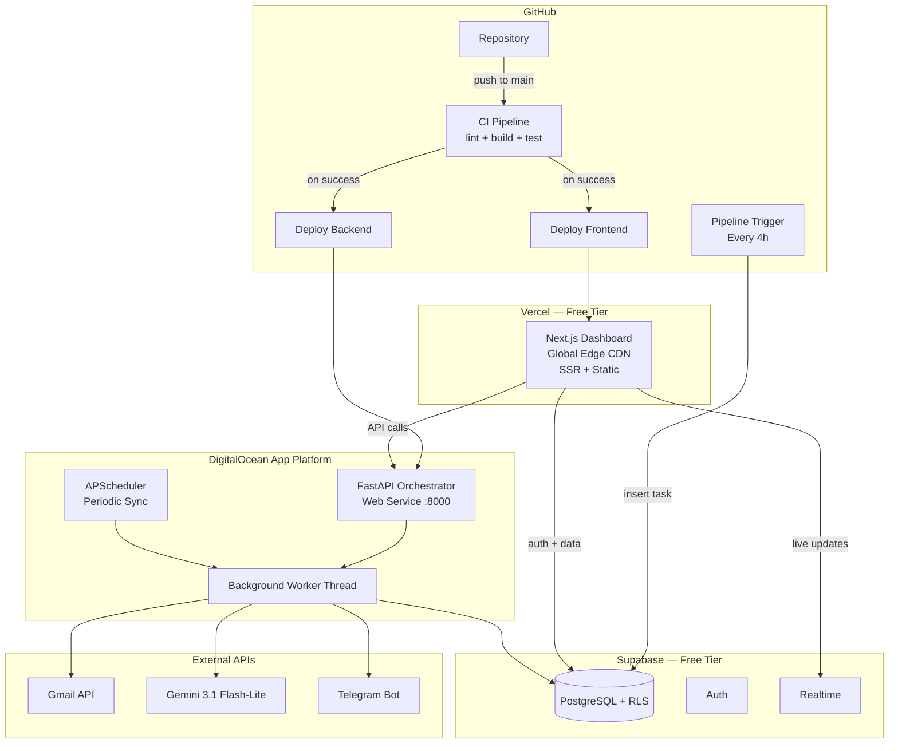

# BewerbLens

> **BewerbLens** — Your intelligent lens on the job application process. An end-to-end, AI-powered job application tracker that automatically ingests, classifies, and monitors your job application emails — then surfaces everything on a beautiful real-time dashboard.

[](https://github.com/maherahmedraza/BewerbLens/actions/workflows/ci.yml)
[](https://github.com/maherahmedraza/BewerbLens/actions/workflows/deploy.yml)
[](https://github.com/maherahmedraza/BewerbLens/actions/workflows/deploy-backend.yml)

---

## Overview

BewerbLens solves a universal problem for job seekers: **tracking applications scattered across email inboxes, spreadsheets, and job portals**. It replaces manual tracking with an automated pipeline that:

1. **Fetches** emails from Gmail continuously
2. **Classifies** them with Google Gemini AI (Applied, Rejected, Interview, Offer, etc.)
3. **Stores** everything in Supabase with zero-duplicate guarantees
4. **Notifies** you via Telegram when status changes occur
5. **Visualizes** your entire job search on a Next.js dashboard with analytics
6. **Orchestrates** background tasks with a dedicated worker and scheduler

---

## Architecture



### Tech Stack

| Component | Tech | Purpose |
|---|---|---|
| **Frontend** | Next.js 16, React 19, Recharts, TanStack Query | Real-time dashboard with Supabase Realtime |
| **Backend** | FastAPI, APScheduler, Python 3.12 | REST API, job scheduling, and worker management |
| **AI Pipeline** | Gemini 3.1 Flash-Lite, Pydantic | Three-stage email classification pipeline |
| **Database** | Supabase (PostgreSQL) | Storage, task queue, auth, realtime, RLS |
| **Frontend Hosting** | Vercel (Free Hobby Tier) | Global Edge CDN, SSR |
| **Backend Hosting** | DigitalOcean App Platform ($5/mo) | Always-on Docker container |
| **CI/CD** | GitHub Actions | Automated lint → test → deploy pipeline |

---

## Features

### System Orchestration
- **Real-time Monitoring** — Granular stage-level progress (Ingestion → Analysis → Persistence) shown live via Supabase Realtime.
- **Smart Scheduling** — Configurable interval (1 h – 24 h) stored in `pipeline_config`; dynamically updated without restart.
- **Pause / Resume** — Toggle the scheduler on/off from the dashboard without touching the server.
- **Run Controls** — Stop an active run, resume a failed/cancelled run, or rerun ingestion/analysis/persistence from the UI.
- **Manual Triggers** — Start a sync or backfill on-demand via the UI or API; returns immediately while execution continues asynchronously.
- **Multi-user** — Full per-user data isolation via Row Level Security; each user supplies their own Gmail credentials and email filter rules.

### AI Pipeline
- **Three-stage execution** — Ingestion, Analysis, and Persistence are tracked independently in `pipeline_run_steps` with per-step progress percentages.
- **Incremental Checkpointing** — Only processes new emails since the last successful run.
- **Gemini 3.1 Flash-Lite** — Default economical classifier model, requested with Structured Outputs / JSON Schema for robust parsing.
- **Fuzzy Matching** — Resolves company/job title naming inconsistencies across email threads and job portals.
- **Status Priority** — Terminal states (Offer, Rejected) are never overwritten by later lower-priority emails.
- **Zombie Detection** — Scheduler runs `HeartbeatMonitor` every 5 minutes to detect and kill stale runs.
- **Consolidated Telegram Reports** — End-of-run summary report instead of per-job spam notifications.
- **Retry & Graceful Degradation** — Exponential-backoff retries; partial successes are saved rather than discarded.

### Premium Dashboard
- **Pipeline View** — Stage-by-stage progress bars, execution history table, config panel (pause, interval, retention), and per-run log drawer.
- **Analytics Hub** — Interactive charts for application trends and platform performance.
- **Modern UI** — Glassmorphic design, dark mode support, and responsive layouts.

---

## Project Structure

```
BewerbLens/
├── .do/                              # DigitalOcean App Spec
│   └── app.yaml                      # Backend service definition
├── .github/
│   └── workflows/
│       ├── ci.yml                    # Lint, test, build (reusable)
│       ├── deploy.yml                # Frontend → Vercel
│       ├── deploy-backend.yml        # Backend → DigitalOcean
│       └── pipeline-trigger.yml      # Cron: 4-hour pipeline sync
├── apps/
│   ├── orchestrator/                 # FastAPI Task Manager
│   │   ├── main.py                   # Entry point (lifespan, CORS, routers)
│   │   ├── routers/                  # REST Endpoints (runs, config)
│   │   └── services/                 # Worker, Scheduler, TrackerService, Config
│   │
│   ├── tracker/                      # AI Processing Pipeline
│   │   ├── tracker.py                # run_pipeline_multiuser() entry point
│   │   ├── classifier_factory.py     # Pluggable classifier (Gemini / future)
│   │   ├── gemini_classifier.py      # Gemini 3.1 Flash-Lite implementation
│   │   ├── fuzzy_matcher.py          # Company/job title deduplication
│   │   ├── failure_handler.py        # Retry, zombie detection, StepExecutor
│   │   ├── pipeline_logger.py        # Buffered DB log sink
│   │   ├── pre_filter.py             # Per-user rule-based email filtering
│   │   ├── telegram_notifier.py      # Consolidated run reports via Telegram
│   │   └── supabase_service.py       # DB operations (pipeline steps, heartbeat)
│   │
│   └── dashboard/                    # Next.js 16 Frontend
│       ├── src/app/                  # App Router pages (pipeline, analytics, …)
│       ├── src/hooks/usePipeline.ts  # TanStack Query + Realtime hooks
│       └── src/components/           # UI Components (charts, tables, logs)
│
├── db/
│   └── migrations/                   # Idempotent SQL migrations (run in order)
├── docs/                             # Detailed Documentation
├── Dockerfile                        # Backend container image
├── requirements.txt                  # Python dependencies
└── README.md                         # This file
```

---

## Quick Start

### 1. Prerequisites
- Python 3.12+ & Node.js 22+
- Supabase Project & Google Cloud Project (Gmail API + Gemini Key)

### 2. Environment Setup
```bash
cp .env.example .env
# Fill in your credentials — see docs/deployment.md for the full variable list
```

### 3. Apply Database Migrations
Run in order against your Supabase project:
```bash
psql "$DATABASE_URL" -f db/migrations/001_multiuser_foundation.sql
psql "$DATABASE_URL" -f db/migrations/002_hotfix_rls_policies.sql
psql "$DATABASE_URL" -f db/migrations/003_views_and_rls.sql
psql "$DATABASE_URL" -f db/migrations/004_application_stats_view.sql
psql "$DATABASE_URL" -f db/migrations/005_enable_realtime.sql
```

### 4. Start Backend Services
```bash
pip install -r requirements.txt
cd apps/orchestrator && python main.py  # FastAPI on port 8000
```

### 5. Start Dashboard
```bash
cd apps/dashboard
npm install && npm run dev
```

Visit `http://localhost:3000` to access the dashboard.

---

## Production Deployment

BewerbLens uses a hybrid cloud architecture for cost-effective production hosting:

| Layer | Platform | Cost |
|---|---|---|
| Frontend | [Vercel](https://vercel.com) (Free Hobby Tier) | $0/mo |
| Backend | [DigitalOcean App Platform](https://cloud.digitalocean.com) | $5/mo (covered by student credit) |
| Database | [Supabase](https://supabase.com) (Free Tier) | $0/mo |
| CI/CD | GitHub Actions | $0/mo |

### CI/CD Pipeline

```
git push → CI (lint + build + test + security scan)
                ├── Frontend: Vercel production deploy
                └── Backend: DigitalOcean container deploy
```

All workflows use **path filtering** — frontend deploys only trigger when `apps/dashboard/**` changes, backend deploys only trigger when `apps/tracker/**` or `apps/orchestrator/**` changes.

See [docs/deployment.md](docs/deployment.md) for full setup instructions.

---

## Documentation

| Document | Description |
|---|---|
| [Architecture & Workflow](docs/architecture.md) | System deep-dive, data flow, multi-user model |
| [API Documentation](docs/api.md) | Orchestrator REST API spec |
| [Deployment Guide](docs/deployment.md) | Local, Vercel, DigitalOcean, and CI/CD setup |
| [Troubleshooting](docs/troubleshooting.md) | Common issues & fixes |
| [Contributing](CONTRIBUTING.md) | Development guidelines and PR workflow |

---

## License

MIT — See [LICENSE](LICENSE) for details.

---

## Author

**Maher Ahmed Raza** — [GitHub](https://github.com/maherahmedraza)
